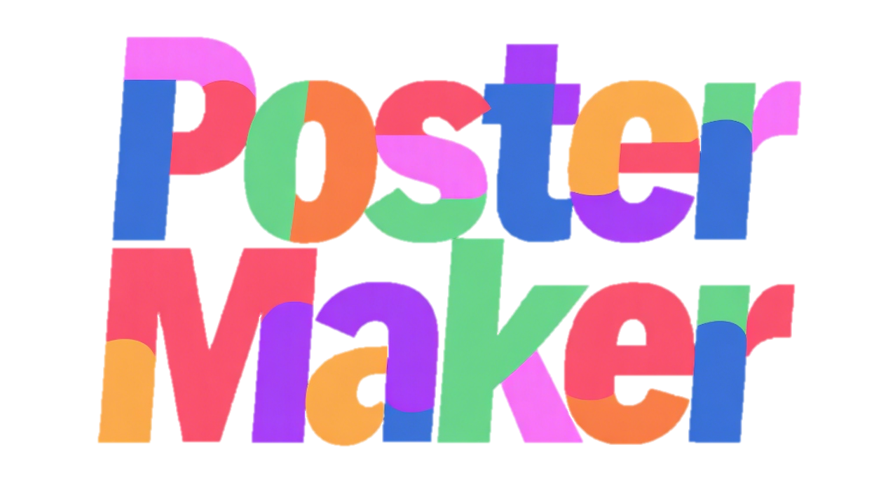

<div align="center">


# PosterMaker: Towards High-Quality Product Poster Generation with Accurate Text Rendering  [](https://poster-maker.github.io)

<a href='https://arxiv.org/abs/2504.06632'></a> <a href='assets/pdfs/CVPR2025_Arxiv.pdf'></a> <a href='https://github.com/alimama-creative/PosterMaker'></a> <a href='https://huggingface.co/alimama-creative/PosterMaker'></a>


**PosterMaker** is supported by the [Alimama Creative](https://huggingface.co/alimama-creative) team. 


</div>


## 🎉 News/Update
- [2025.11.12] ***Training Code  has been released!!!***
- [2025.04.18] Inference Code & Model Weights has been released!
- [2025.04.10] PosterMaker is Accepted by CVPR 2025!


## ⏰ Release Schedule Announcement
- [✅] **Inference Code & Demo**: Expected by ~~April 15th, 2025~~ April 18th, 2025
- [✅] **Training Code**: Expected by June 10th, 2025

We are working diligently to ensure the quality of our releases. We greatly appreciate your continued interest and support in our project. Please stay tuned for these upcoming releases.

**UPDATE**: The Inference Code & Demo has now been released

## Environment
**Note:** The environment of SD3 model depends on Pytorch>=2.0.0 and CUDA >= 11.7
```bash
# create conda env
conda create -n postermaker python=3.10
# activate conda env
conda activate postermaker
# install requirements
pip install -r requirements.txt
```

## Model Preparation
Download the SD3 weights from [HuggingFace](https://huggingface.co/stabilityai/stable-diffusion-3-medium-diffusers) to `./checkpoints/stable-diffusion-3-medium-diffusers`

Download the PosterMaker weights from [HuggingFace](https://huggingface.co/alimama-creative/PosterMaker) to `./checkpoints/our_weights`

A table is shown below, with different weight names and download addresses:

| Model Name | Weight Name | Download Link |
| --- | --- | --- |
| TextRenderNet_v1 | textrender_net-0415.pth | [HuggingFace](https://huggingface.co/alimama-creative/PosterMaker) |
| SceneGenNet_v1 | scenegen_net-0415.pth | [HuggingFace](https://huggingface.co/alimama-creative/PosterMaker) |
| SceneGenNet_v1 with Reward Learning | scenegen_net-rl-0415.pth | [HuggingFace](https://huggingface.co/alimama-creative/PosterMaker) |
| TextRenderNet_v2 | textrender_net-1m-0415.pth | [HuggingFace](https://huggingface.co/alimama-creative/PosterMaker) |
| SceneGenNet_v2 | scenegen_net-1m-0415.pth | [HuggingFace](https://huggingface.co/alimama-creative/PosterMaker) |

**NOTE:** TextRenderNet_v2 is trained with more data for training in the Stage 1, resulting in better text rendering effects. Related details can be found in Section 8 of the Supplementary Materials.

Finally, the folder structure is as follows:
```bash
.
├── checkpoints
│   ├── stable-diffusion-3-medium-diffusers
│   └── our_weights
├── models
├── pipelines
├── images
├── assets
├── ...
```

## Inference
First, modify the input data in `inference.py: Line 139`.

**User Input Example**:

Text Limitations
- Maximum 7 lines of text
- ≤16 characters per line
- Coordinates within image boundaries
```python
# single user input
image_path = f'./images/rgba_images/{FILENAME}'
mask_path  = f'./images/subject_masks/{FILENAME}'
prompt = """The subject rests on a smooth, dark wooden table, surrounded by a few scattered leaves and delicate flowers,\
            with a serene garden scene complete with blooming flowers and lush greenery in the background."""
texts = [
        {"content": "护肤美颜贵妇乳", "pos": [69, 104, 681, 185]},
        {"content": "99.9%纯度玻色因", "pos": [165, 226, 585, 272]},
        {"content": "持久保年轻", "pos": [266, 302, 483, 347]}
]
```

The following command is used to generate images.

**Example Command**:
```bash
python inference.py \
--pretrained_model_name_or_path='./checkpoints/stable-diffusion-3-medium-diffusers/' \
--controlnet_model_name_or_path='./checkpoints/our_weights/scenegen_net-rl-0415.pth' \
--controlnet_model_name_or_path2='./checkpoints/our_weights/textrender_net-0415.pth' \
--seed=42 \
--num_images_per_prompt=4 # number of images to generate
```
Finally, the generated images will be saved in `./images/results/`.

## Training
To train the model, please refer to `train.sh`.

You first need to extract your data to the specified location `./dataset`  

The paths to training and validation data can be modified in `poster_dataset_e2e_train.py: Line 16`:
```python
GT_IM_SAVE_PATH = './dataset/cvpr25_training_dataset_release/images/gt/'
SUBJECT_MASK_SAVE_PATH = './dataset/cvpr25_training_dataset_release/images/mask/'
DATA_SAMPLES_PATH = './dataset/cvpr25_training_dataset_release/cvpr_training_data.json'
```

The validation paths can be modified in `poster_dataset_e2e_eval.py: Line 15`.  
Please note that validation data for stage 1 and stage 2 are different:
```python
# stage2 eval
STAGE2_GT_IM_SAVE_PATH = './dataset/cvpr25_release_benchmark_stage2/gt/'
STAGE2_SUBJECT_MASK_SAVE_PATH = './dataset/cvpr25_release_benchmark_stage2/mask/'
STAGE2_DATA_SAMPLES_PATH = './dataset/cvpr25_release_benchmark_stage2/text_render_benchmark.json'

# stage1 eval
STAGE1_GT_IM_SAVE_PATH = './dataset/cvpr25_release_benchmark_stage1/gt/'
STAGE1_SUBJECT_MASK_SAVE_PATH = './dataset/cvpr25_release_benchmark_stage1/mask/'
STAGE1_DATA_SAMPLES_PATH = './dataset/cvpr25_release_benchmark_stage1/text_render_benchmark.json'
```

Reference commands for starting training can be found in `train.sh`.  
Please adjust the batch size and number of GPUs according to your environment.  
We recommend using 32 A100 GPUs for training.


## Known Limitations
The current model exhibits the following known limitations stemming from processing strategies applied to textual elements and captions during constructing our training dataset:

**Text** 
- During training, we restrict texts to 7 lines of up to 16 characters each, and the same applies during inference.
- The training data comes from e-commerce platforms, resulting in relatively simple text colors and font styles with limited design diversity. This leads to similarly simple styles in the inference outputs.


**Layout**
- Only horizontal text boxes are supported (since the amount of vertical text boxes was insufficient, we excluded them from training data)
- Text box must maintain aspect ratios proportional to content length for optimal results (derived from tight bounding box annotations in training)
- No automatic text wrapping within boxes (multi-line text was split into separate boxes during training)

**Prompt Behavior**
- Text content should not be specified in prompts (to match the training setting).
- Limited precise control over text attributes. For poster generation, we expect the model to automatically determine text attributes like fonts and colors. Thus, descriptions about text attributes were intentionally suppressed in training captions.

## Citation
If you find PosterMaker useful for your research and applications, please cite using this BibTeX:

```BibTeX
@misc{gao2025postermakerhighqualityproductposter,
          title={PosterMaker: Towards High-Quality Product Poster Generation with Accurate Text Rendering}, 
          author={Yifan Gao and Zihang Lin and Chuanbin Liu and Min Zhou and Tiezheng Ge and Bo Zheng and Hongtao Xie},
          year={2025},
          eprint={2504.06632},
          archivePrefix={arXiv},
          primaryClass={cs.CV},
          url={https://arxiv.org/abs/2504.06632},
}
```

## LICENSE
The model is based on SD3 finetuning; therefore, the license follows the original [SD3 license](https://huggingface.co/stabilityai/stable-diffusion-3-medium#license).
